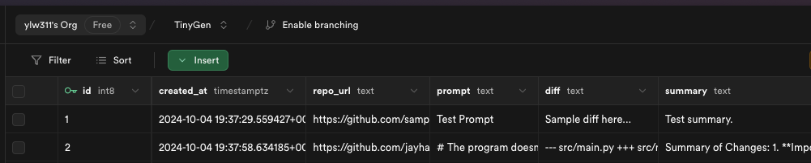

# TinyGen 
Author: Linda Wang


<!-- TODO give the public URL to hit  -->
Public API URL: https://tinygen-linda.onrender.com/generate-diff

You can see the api documentation at https://tinygen-linda.onrender.com/docs


<!-- TODO table of contents? -->


## Feature Summary

- Clone a public GitHub repository.
- Generate a unified diff based on a textual prompt and the repository's code.
- Perform self reflections to improve the generated diff.
- Perform self validation to ensure the generated diff solves the problem. 
- Store inputs and outputs in Supabase.
- Expose an API endpoint for external use.

## Requirements

- Python 3.7 or higher
- Git
- Supabase
- OpenAI API key (configured locally in your environment)
- Virtualenv (recommended)


## Local Installation

### Clone the Repository

```bash
git clone https://github.com/yourusername/your-repo-name.git
cd your-repo-name
```


1. Install dependencies

    ```bash
    python3 -m venv venv
    source venv/bin/activate
    pip install -r requirements.txt
    ```

2. Set up credentials in environment file

    Please create a `.env` file in the root directory of the project and fill out the fields as shown in the `.env.example` file.

3. To run the app locally, execute the following command:

    ```bash
    cd src
    uvicorn main:app --reload
    ```

The app will be running at http://127.0.0.1:8000


## API Usage

### Endpoint

**POST** `/generate-diff`

- **Description**: Generates a unified diff based on the provided repository URL and prompt.

- **Request Body**:
  
  ```json
  {
    "repoUrl": "string",
    "prompt": "string"
  }


## User Note 
If TinyGen could not give a good answer, it will return `None` for diff and "Reflection failed after multiple attempts." for the summary. The client may handle the `None` case as needed.


## Design Considerations
The app is designed to be modular and scalable. Notice in llm.py it is easy to swap out the model for a different one. 

Code structure is organized as follows:
- `main.py`: Contains the FastAPI application and the API endpoints.
- `diff.py`: Contains the diff generation and reflection algorithms.
- `llm.py`: Contains openai models for modularity and easy swapping.
- `requests.py`: Contains type checking for the request body.
- Utils
    - `prompts.py`: Contains the prompt engineering functions.
    - `tools.py`: Contains utility functions for file parsing and diff generation.


### Algorithm 
- Initial Diff Generation: Uses file parsing and prompt engineering to generate a code diff. Few shot prompt engineering is used to generate the diff.
- Reflection Algorithm: Iteratively improves the diff through feedback loops with the LLM.
    - Recursive Reflection: Allows the model to reflect on its own answers, improving the diff through repeated iterations.

- Validation Algorithm: Ensures that the generated diff solves the problem.

### Database (Supabase)

Once a valid diff and its corresponding summary are produced, the code stores the results (including repo URL, prompt, diff, and summary) in a Supabase table. This ensures that all generated results are persisted for future reference.

Supabase Table: `tinygen_requests`

| Column Name  | Data Type     | Description                                                    |
|--------------|---------------|----------------------------------------------------------------|
| `id`         | `int8`        | Primary key, auto-incrementing identifier for each request.     |
| `created_at` | `timestamptz` | Timestamp of when the request was created.                     |
| `repo_url`   | `text`        | URL of the Git repository being analyzed.                      |
| `prompt`     | `text`        | The user-provided prompt describing the task.                  |
| `diff`       | `text`        | The generated diff or code changes.                            |
| `summary`    | `text`        | Summary of the changes made by the diff.                       |


- **Primary Key:** The `id` column is the primary key, unique, and auto-incrementing.
- **Timestamps:** The `created_at` column stores a timestamp with time zone information.
- **Text Fields:** The `repo_url`, `prompt`, `diff`, and `summary` columns store text for the repository URL, prompt, code diff, and summary.

Example Screenshot of Supabase Table:



## Next Steps
1. Tune the prompts to improve the quality of the generated diff.
    - The quality of the diff is highly dependent on the prompt. Perhaps consider using xml tags for better parsing by the llm (**dependent on model used**).


2. As the repository gets large, would incorporate tree-based filtering on the repository and individual functions to pinpoint the exact location of issue. However, since TinyGen only work with small repositories, doing so is unnecessary and would only slow down the process.

    Specifically:
    We can use the repository tree to filter out files that are not relevant to the prompt, and using the function tree to filter out functions that are not relevant to the prompt. The repository with this functionality was shared with Chase at Hack the North (let me know if anyone else may want access or a demo of it): https://github.com/ylw311/Repo-Traverse

## Remarks
Thanks for the assessment :) (seriously)

I actually dived into this project right after my midterms so I was a bit burnt out. But this project ended up being super fun and I ended up spending more time on it than I intended to. Might continue working on this further and make it a bit more robust just for fun as well. 

This little project took ~5h to complete (mostly spent on code reorg and documentation...).

Roughly timed my workflow:
- 30 min on a working prototype
    - at this point the code was ready to run, it generated a unified diff given prompt and repo url. But at the current stage it was monorepo and not modular. Bad code practices and not scalable.
- 10 min on supabase setup, connections, and table creation
- 1.5h on code reorganization and design
    - To me, the most important part of any app is modularity and scalability, thereby maintainability. 
- 20 min on fine tuning the prompts for better diff results 
- 2h on readme, documentation throughout the code, and comments
    - I find documentation to be the most important part of a project...potentially not worth the time for TinyGen given it was just a small assessment and I assume most just glance over readmes but to me this is very important.
- 15 min to deploy, github push, share to team, email...

There were one or two breaks in between the creation of TinyGen (or my tiny baby). Anyway I'll stop rambling now. Thanks for reading this far.

